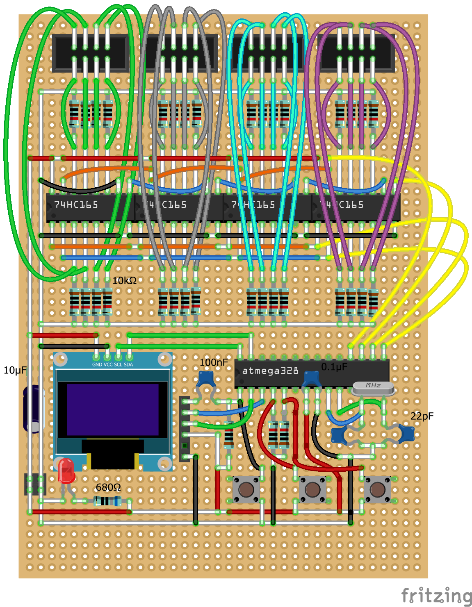

# Hex Reader

A test tool to display up to 32 bits sampled from a digital circuit.

Values are displayed in decimal, hex and binary.

The `74HC165` ICs are to effectively increase the number of GPIO pins on the Ardiuno Nano arbitrarily.

Translated onto perf board:

The completed project looks like this:

